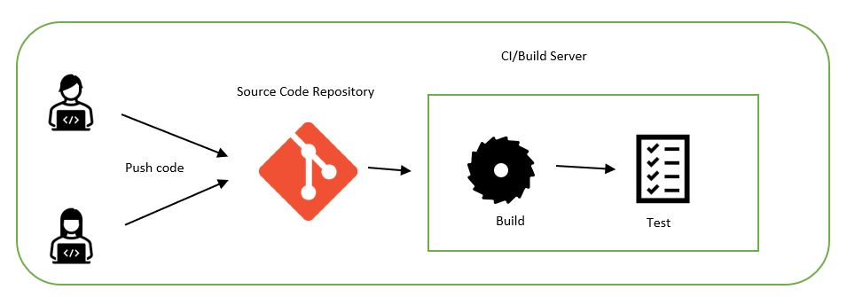

CI is a software development practice where members of a team integrate their work frequently. Each integration is verified by an automated build (including test) to detect integration errors as quickly as possible.

Continuous integration requires that all the code changes be maintained in a single code repository where all the members can push the changes to their feature branches regularly. The code changes must be quickly integrated with the rest of the code and automated builds should happen and feedback to the member to resolve them early.

There should be a CI server where it can trigger a build as soon as the code is pushed by a member. The build typically involves compiling the code and transforming it to an executable file such as JARs or DLLs etc. called packaging. It must also perform [unit tests](https://en.wikipedia.org/wiki/Unit_testing) with code coverage. Optionally, the build process can have additional stages such as static code analysis and vulnerability checks etc.

[Jenkins](https://www.jenkins.io/), [Bamboo](https://confluence.atlassian.com/bamboo/understanding-the-bamboo-ci-server-289277285.html), [Travis CI](https://travis-ci.org/), [GitLab](https://about.gitlab.com/), [Azure DevOps](https://azure.microsoft.com/en-in/services/devops/) etc. are the few popular CI tools. These tools provide various plugins and integration such as [ant](https://ant.apache.org/), [maven](https://maven.apache.org/) etc. for building and packaging, and Junit, selenium etc. are for performing the unit tests. [SonarQube](https://www.sonarqube.org/) can be used for static code analysis and code security.

*Fig 1: Continuous Integration Pipeline*

*Fig 2: Continuous Integration Process*