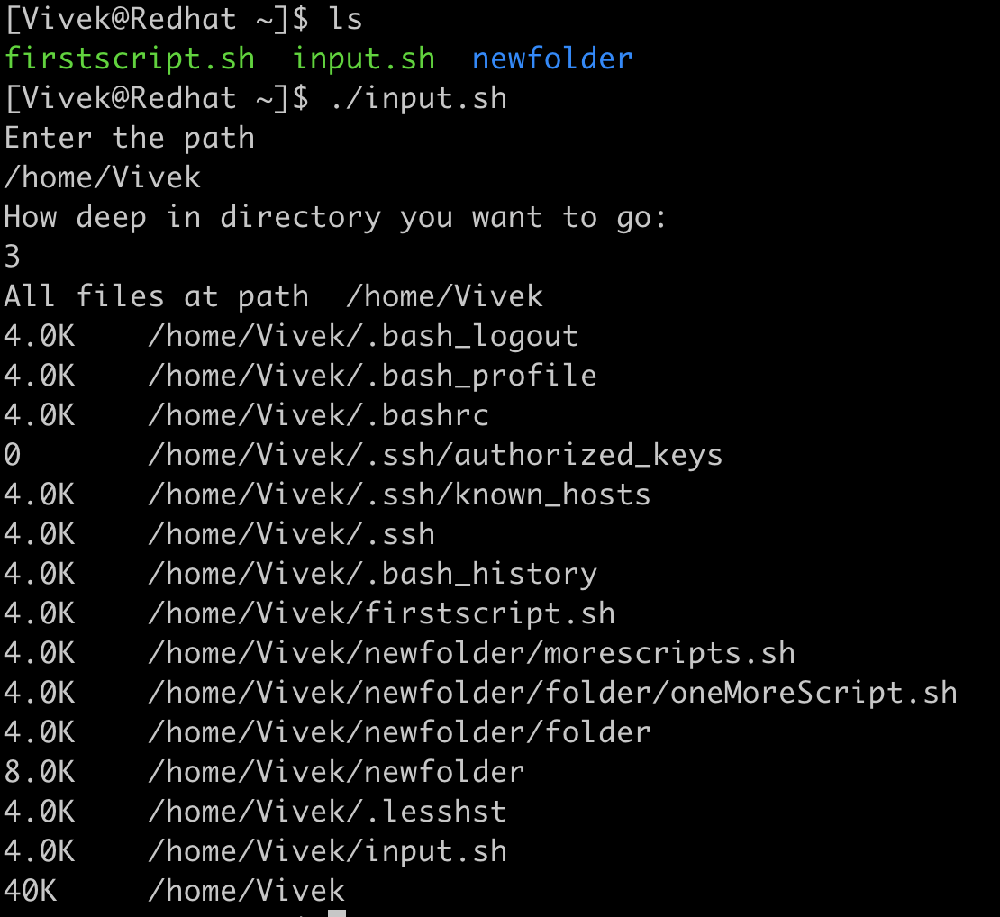
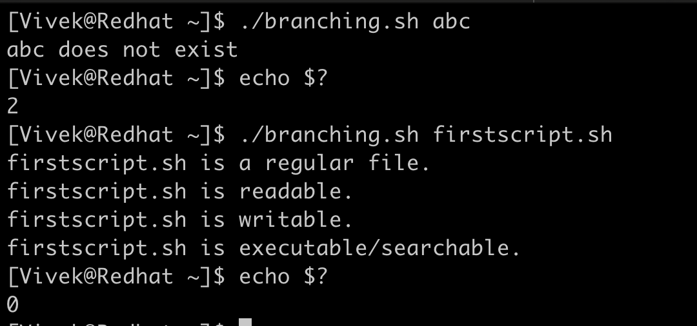
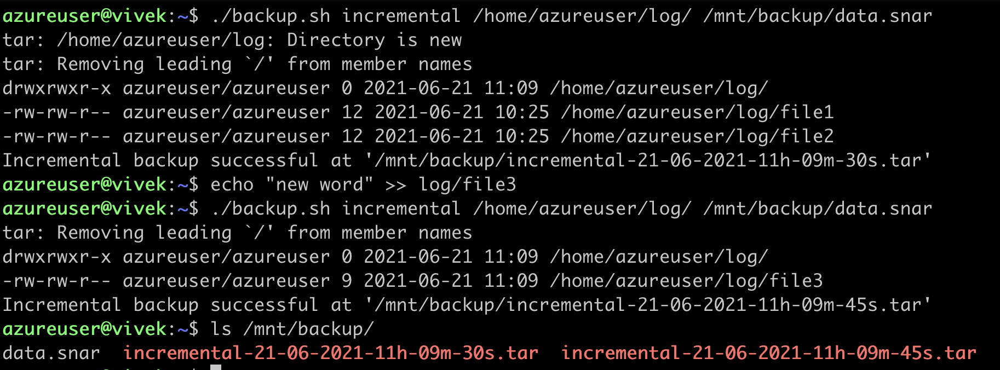

# Bash Scripting

## Introduction
As an SRE, the Linux system sits at the core of our day to day work and so is bash scripting. It’s a scripting language that is run by Linux Bash Interpreter. Until now we have covered a lot of features mostly on a command line, now we will use this command line as an interpreter to write programs that will ease our day to day job as an SRE.

## Writing the first bash script:

We will start with a simple program, we will use Vim as the editor during the whole journey.

```
#!/bin/bash

# This if my first bash script
# Line starting with # is commented

echo "Hello world!"
```

The first line of the script starting with “#!” is called she-bang. This is simply to let the system which interpreter to use while executing the script.

Any Line starting with “#” (other than #!) is referred to as comments in script and is ignored by the interpreter while executing the script. Line 6 shows the “echo” command that we would be running.

We will save this script as “firstscript.sh” and make the script executable using `chmod`.


Next thing is to run the script with the explicit path. We can see the desired “Hello World!” as output.

## Taking user input and working with variables:

Taking standard input using the `read` command and working with variables in bash.

```
#!/bin/bash

#We will take standard input
#Will list all files at the path
#We will concate variable and string

echo "Enter the path"
read path

echo "How deep in directory you want to go:"
read depth

echo "All files at path " $path

du -d $depth -all -h $path
```

We are reading path in variable “*path*” and variable “*depth*” to list files and directories up to that depth. We concatenated strings with variables. We always use `$` (dollar-sign) to reference the value it contains.



We pass these variables to the `du` command to list out all the files and directories in that path upto the desired depth.

## Exit status:

Every command and script when it completes executing, returns an integer in the range from 0 to 255 to the system, this is called exit status. “0” denotes success of the command while non-zero return code usually indicates various kinds of errors.


We use `$?` special shell variable to get exit status of the last executed script or command.

## Command line arguments and understanding If … else branching:

Another way to pass some values to the script is using command line arguments. Usually command line arguments in bash are accessed by $ followed by the index. The 0th index refers to the file itself, `$1` to the first argument and so on. We use `$#` to check the count of arguments passed to the script.

Making decisions in the programming language is it’s integral part, and to tackle different conditions we use if … else statements or some more nested variant of it.

The below script uses multiple concepts in one script. The aim of the script is to get some properties of the file.

Line 4 to 7 is the standard example of "if statement" in bash. Syntax is as explained below:
```
If [ condition ]; then

If_block_to_execute

else

else_block_to_execute

fi
```

fi is to close the if … else block. We are comparing count of argument($#) if it is equal to 1 or not. If not we prompt for only one argument and exit the script with status code 1(not a success). One or more if statements can exist without else statement but vice versa doesn’t make any sense.

Operator -ne is used to compare two integers, read as “integer1 *not equal to* integer 2”. Other comparison operators are:

| Operations | Description |
| --- | --- |
| **num1 -eq num2** | check if 1st number is equal to 2nd number |
| **num1 -ge num2** | checks if 1st number is greater than or equal to 2nd number |
| **num1 -gt num2** | checks if 1st number is greater than 2nd number |
| **num1 -le num2** | checks if 1st number is less than or equal to 2nd number |
| **num1 -lt num2** | checks if 1st number is less than 2nd number |

```
#!/bin/bash
# This script evaluate the status of a file

if [ $# -ne 1 ]; then
    echo "Please pass one file name as argument"
    exit 1
fi

FILE=$1
if [ -e "$FILE" ]; then
    if [ -f "$FILE" ]; then
        echo "$FILE is a regular file."
    fi
    if [ -d "$FILE" ]; then
        echo "$FILE is a directory."
    fi
    if [ -r "$FILE" ]; then
        echo "$FILE is readable."
    fi
    if [ -w "$FILE" ]; then
        echo "$FILE is writable."
    fi
    if [ -x "$FILE" ]; then
        echo "$FILE is executable/searchable."
    fi
else
    echo "$FILE does not exist"
    exit 2
fi

exit 0
```

There are lots of file expressions to evaluate file,like in bash script “-e” in line 10 returns true if the file passed as argument exist, false otherwise. Below are the some widely used file expressions:

| File Operations | Description |
| --- | --- |
| **-e file** | File exists |
| **-d file** | File exists and is directory |
| **-f file** | File exists and is regular file |
| **-L file** | File exists and is symbolic link |
| **-r file** | File exists and has readable permission |
| **-w file** | File exists and has writable permission |
| **-x file** | File exists and has executable permission |
| **-s file** | File exists and size is greater than zero |
| **-S file** | File exists and is a network socket. |



Exit status is 2 when the file is not found. And if the file is found it prints out the properties it holds with exit status 0(success).

## Looping over to do a repeated task.

We usually come up with tasks that are mostly repetitive, looping helps us to code those repetitive tasks in a more formal manner. There are different types of loop statement we can use in bash:

| Loop | Syntax |
| --- | --- |
| while | while \[ expression \]<br><br>do <br><br>    \[ while\_block\_to_execute \]<br><br>done |
| for | for variable in 1,2,3 .. n<br><br>do <br><br>    \[ for\_block\_to_execute \]<br><br>done |
| until | until \[ expression \] <br><br>do <br><br>    \[ until\_block\_to_execute \]<br><br>done |

```
#!/bin/bash
#Script to monitor the server

hosts=`cat host_list`

while true
do
    for i in $hosts
    do
    	h="$i"
    	ping -c 1 -q "$h" &>/dev/null
    	if [ $? -eq 0 ]
    	then
        	echo `date` "server $h alive"
    	else
        	echo `date` "server $h is dead"
    	fi
    done
    sleep 60
done
```

Monitoring a server is an important part of being an SRE. The file “host_list” contains the list of host which we want to monitor.

We used an infinite “while” loop that will sleep every 60seconds. And for each host in the host_list we want to ping that host and check if that ping was successful with its exit status, if it’s successful we say server is live or it’s dead.


The output of the script shows it is running every minute with the timestamp.

## Function

Developers always try to make their applications/programs in modular fashion so that they don’t have to write the same code every time and everywhere to carry out similar tasks. Functions help us achieve this.

We usually call functions with some arguments and expect result based on that argument.

The backup process we discussed in earlier section, we will try to automate that process using the below script and also get familiar with some more concepts like string comparison, functions and logical AND and OR operations.

In the below code “log_backup” is a function which won’t be executed until it is called.

Line37 will be executed first where we will check the no. of arguments passed to the script.

There are many logical operators like AND,OR, XOR etc.

| Logical Operator | Symbol |
| --- | --- |
| AND | &&  |
| OR  | \|  |
| NOT | !   |

Passing the wrong argument to script “backup.sh” will prompt for correct usage. We have to pass whether we want to have incremental backup of the directory or the full backup along with the path of the directory we want to backup. If we want the incremental backup we will an additional argument as a meta file which is used to store the information of previous backed up files.(usually a metafile is .snar extension).

```
#!/bin/bash
#Scripts to take incremental and full backup

backup_dir="/mnt/backup/"
time_stamp="`date +%d-%m-%Y-%Hh-%Mm-%Ss`"

log_backup(){
	if [ $# -lt 2 ]; then
		echo "Usage: ./backup.sh [backup_type] [log_path]"
		exit 1;
	fi
	if [ $1 == "incremental" ]; then
		if [ $# -ne 3 ]; then
			echo "Usage: ./backup.sh [backup_type] [log_path] [meta_file]"
			exit 3;
		fi
		tar --create --listed-incremental=$3 --verbose --verbose --file="${backup_dir}incremental-${time_stamp}.tar" $2
		if [ $? -eq 0 ]; then
			echo "Incremental backup succesful at '${backup_dir}incremental-${time_stamp}.tar'"
		else
			echo "Incremental Backup Failure"
		fi

	elif [ $1 == "full" ];then
		tar cf "${backup_dir}fullbackup-${time_stamp}.tar" $2
		if [ $? -eq 0 ];then
			echo "Full backup successful at '${backup_dir}fullbackup-${time_stamp}.tar'"
		else
			echo "Full Backup Failure"
		fi
	else
		echo "Unknown parameter passed"
		echo "Usage: ./backup.sh [incremental|full] [log_path]"
		exit 2;
	fi
}

if [ $# -lt 2 ] || [ $# -gt 3 ];then
	echo "Usage: ./backup.sh [incremental|full] [log_path]"
	exit 1
elif [ $# -eq 2 ];then
	log_backup $1 $2
elif [ $# -eq 3 ];then
	log_backup $1 $2 $3
fi
exit 0
```

Passing all 3 arguments for incremental backup will take incremental backup at “/mnt/backup/” with each archive having timestamp concatenated to each file.



The arguments passed inside the function can be accessed via `$` followed by the index. The 0th index refers to the function itself,

`$1` to the first argument and so on. We use `#$` to check the count of arguments passed to the function.

Once we pass the string “incremental” or “full” it gets compared inside the function and the specific block is executed. Below are some more operations that can be performed over strings.

| String Operations | Description |
| --- | --- |
| string1 == string2 | Returns true if string1 equals string 2 otherwise false. |
| string1 != string2 | Returns true if string NOT equal string 2 otherwise false. |
| string1 ~= regex | Returns true if string1 matches the extended regular expression. |
| -z string | Returns true if string length is zero otherwise false. |
| -n string | Returns true if string length is non-zero otherwise false. |
